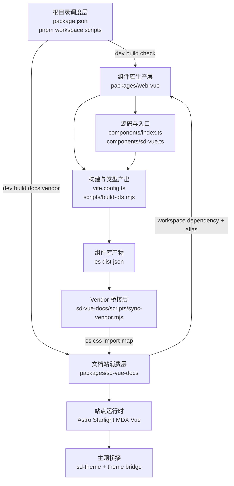
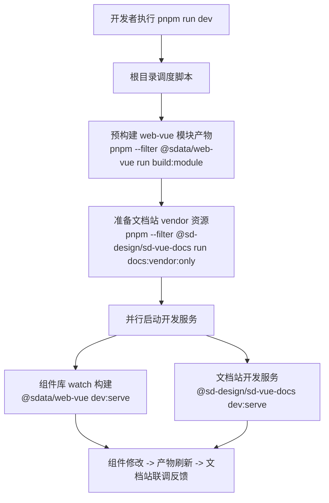
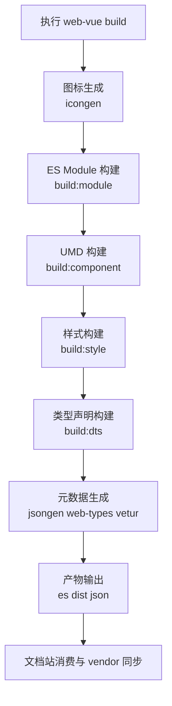

# SD Design 前端架构说明

## 总览

以 `packages/web-vue` 为核心产物、以 `packages/sd-vue-docs` 为消费与展示层的双包协同架构。

- 根目录负责统一调度开发、构建、校验和发布前检查。
- `packages/web-vue` 负责组件源码、样式、类型声明和 IDE 元数据产出。
- `packages/sd-vue-docs` 负责文档页面、在线示例、主题桥接和站点构建。

## 模块关系图

## 技术栈

- Monorepo：`pnpm workspace`
- 组件库：`Vue 3`、`TypeScript`、`Vite`、`vite-plus`
- 文档站：`Astro`、`Starlight`、`MDX`、`@astrojs/vue`
- 样式体系：`scss` + 组件样式入口 + 文档站 vendor CSS 同步
- 质量保障：`Vitest`、`oxlint`、`oxfmt`、`stylelint`

## 模块分层

### 根目录调度层

根目录 `package.json` 是整个仓库的流程中枢。它不承载业务实现，而是负责把两个核心包串起来。

- `dev` / `dev:all`：组织组件库预构建、文档站 vendor 准备和双服务并行启动。
- `build` / `build:all`：组织组件库构建与文档站构建。
- `check` / `check:ci` / `release:check`：统一格式、lint、测试和全量构建校验。

这个设计的重点是让开发和 CI 都从 monorepo 根入口起跑，减少各包脚本分散维护带来的偏差。

### 组件库生产层

`packages/web-vue` 是仓库的核心生产者，负责生成可发布、可类型检查、可文档消费的组件库产物。

- `components/index.ts`：按需导出入口。
- `components/sd-vue.ts`：全量安装插件入口。
- `vite.config.ts`：定义模块构建、UMD 构建、样式构建和测试支持配置。
- `scripts/build-dts.mjs`：负责类型声明构建和复制。
- `json/`：承载 web-types、vetur 等 IDE 元数据。

这个包的职责不只是“把 Vue 组件编译出来”，而是同时服务四类场景：

- 业务项目按需引入
- 浏览器直连或 UMD 消费
- TypeScript 类型系统
- IDE 智能提示与元数据消费

### 文档站消费层

`packages/sd-vue-docs` 不是单纯的 markdown 渲染器，而是组件库的首个真实消费方。

- 使用 Astro + Starlight 组织文档页面与站点结构。
- 使用 `@astrojs/vue` 承载 Vue 示例组件。
- 通过 workspace 依赖直接消费 `@sdata/web-vue`。
- 通过 Vite alias 直接指向组件库源码和样式目录，以保证示例与实现一致。

### Vendor 桥接层

`packages/sd-vue-docs/scripts/sync-vendor.mjs` 是当前架构里非常关键的一层。

它会把组件库产出的浏览器可消费资源同步到文档站的 `public/vendor`，主要包括：

- `packages/web-vue/es` 模块产物
- 组件库样式编译结果
- 浏览器依赖 bundle
- import map

这层存在的意义，是把“组件源码/构建产物”和“文档站浏览器运行环境”隔离开。凡是在线编辑器、浏览器端模块加载、示例样式失真等问题，都应优先检查这里。

## 关键流程

## 开发流程图

## 构建流程图

### 本地开发流程

根目录 `pnpm run dev` 的实际语义不是简单地“起两个服务”，而是分成三步：

1. 先构建 `web-vue` 的模块产物。
2. 再同步文档站 vendor 资源。
3. 最后并行启动组件库 watch 构建和文档站开发服务。

这个顺序说明文档站并不独立，它依赖组件库的最新构建结果和同步出的浏览器资源。

### 组件库构建流程

`packages/web-vue` 的构建大体分为：

1. 图标生成
2. ES Module 构建
3. UMD 构建
4. 样式构建
5. 类型声明构建
6. `web-types` 等 IDE 元数据生成

排查构建失败时，应该先区分失败点属于资源生成、打包、样式编译还是类型产出，而不是笼统地看作“build 挂了”。

### 文档站构建流程

文档站的 `dev`、`build`、`preview` 都会先执行 `docs:vendor`。这意味着：

- 文档站能否稳定运行，依赖 vendor 资源是否已准备好。
- 示例异常不一定是页面内容问题，也可能是 vendor 产物过期或缺失。

### 主题联动流程

文档站在 Astro 配置里注入 theme bridge 脚本，监听站点主题切换并同步 `body` 上的 `sd-theme` 属性。

这说明站点主题系统和组件库主题系统不是天然共用一套运行时状态，而是通过桥接脚本显式同步。暗色模式异常、局部浮层主题不一致等问题，优先检查这层同步。

### 质量门禁流程

根目录的 `check`、`check:ci` 和 `release:check` 把格式化检查、lint、测试和全量构建串成统一质量门。

这套设计的意图很明确：所有最终要进主干或发版的改动，都应该经过根目录级别的统一校验，而不是只在单包里做局部验证。

## 上手建议

如果刚接触这个仓库，按下面顺序理解最快：

1. 先看根目录 `package.json`，理解统一入口有哪些。
2. 再看 `packages/web-vue`，明确组件库是如何产生产物的。
3. 再看 `packages/sd-vue-docs`，理解文档站如何消费组件库。
4. 最后看 vendor 同步脚本和主题桥接，理解联调时为什么会出现跨包问题。

## 维护者排障索引

- 文档站能启动，但示例不对：先看 vendor 同步层和 `packages/web-vue/es` 是否最新。
- 暗色主题或浮层样式异常：先看 theme bridge 和组件主题运行时同步。
- 构建失败：先分辨是图标、模块、样式、类型还是元数据阶段出错。
- 单包测试通过但根流程失败：优先回到根目录入口复现，确认是否是跨包联动问题。
- 文档内容正常但浏览器端 import 失败：优先检查 import map 和 vendor 依赖 bundle。

## 架构判断

- 这个仓库的核心不是单纯维护组件源码，而是维护一条完整的前端交付链：组件实现、样式体系、类型声明、IDE 元数据、文档渲染和在线示例运行时都在同一仓库内闭环。
- `packages/web-vue` 是生产者，`packages/sd-vue-docs` 是首个消费者，两者通过 workspace 依赖、源码别名和 vendor 同步三层机制耦合。这样做的好处是文档与真实组件实现不容易漂移，代价是任何构建链路变更都需要同时考虑文档站联动。
- 根目录脚本故意保持“少而统一”，说明这个仓库当前更强调稳定协作和可预测流程，而不是把构建职责分散到更多内部工具包中。
